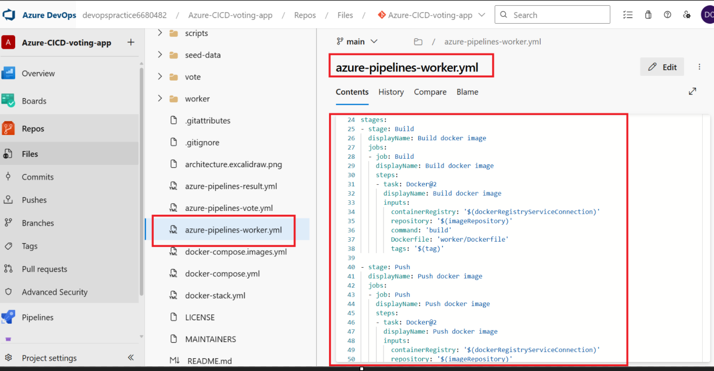

## CI/CD Implementation Using Azure DevOps

This project demonstrates the implementation of a CI/CD pipeline leveraging Azure DevOps and various Azure resources, including Azure Virtual Machines (VM), Azure Container Registry (ACR), Azure Kubernetes Service (AKS), and other azure related services.

# Azure DevOps CI/CD Pipeline for Voting Application

## Project Overview
This project is designed to automate the deployment of a sample voting application using Azure DevOps pipelines. The application consists of multiple services, each containerized and deployed to an AKS cluster. The CI/CD pipeline is configured to build, test, and deploy the application automatically upon code changes.

## Prerequisites
- An Azure DevOps account and organization.
- A Git repository containing the source code of the voting application.
- Azure CLI installed and configured.
- Access to an Azure subscription with permissions to create resources.
- Basic knowledge of Docker, Kubernetes, and Azure DevOps.

## Implementation Steps

1. **Create Azure DevOps Project and Repository**
   - Sign in to Azure DevOps and create a new project.
   - Create a new Git repository within the project to host the voting application code.

## Reference Documentation

- [Example Voting App on GitHub](https://github.com/dockersamples/example-voting-app): Sample multi-service application used for demonstrating containerization and orchestration concepts.
- [Azure DevOps for Beginners: How to Set Up Your Account, Organization, and Repository](https://techcommunity.microsoft.com/blog/educatordeveloperblog/azure-devops-for-beginners-how-to-set-up-your-account-organization-and-repositor/3790002): Step-by-step guide for getting started with Azure DevOps, including account and repository setup.
- [Azure Pipelines Linux Agent Documentation](https://learn.microsoft.com/en-us/azure/devops/pipelines/agents/linux-agent?view=azure-devops&tabs=IP-V4): Official Microsoft documentation on configuring and using Linux build agents in Azure Pipelines.
- [Azure DevOps Labs: YAML Pipelines](https://azuredevopslabs.com/labs/azuredevops/yaml/): Hands-on labs for learning how to create and manage CI/CD pipelines using YAML in Azure DevOps.
- [Building a Simple CI/CD Pipeline with Azure DevOps (Medium)](https://medium.com/@lamjed.gaidi070/building-a-simple-ci-cd-pipeline-with-azure-devops-218e5dac2d61): Tutorial on implementing a basic CI/CD pipeline using Azure DevOps, with practical examples.

## Outcomes of end to end Azure CICD pipeline

---

- 
- 
- 
- 
- 
- 
- 
- 
- 
- 
- 
- 
- 
- 
- 
- 
- 
- 
- 
- 
- 
- 
- 
- 
- 
- 
- 
- 
- 
- 
- 
- 
- 
- 
- 
- 
- 
- 
- 
- 
- 
- 
- 
- 
- 
- 
- 
- 
- 
- 
- 
- 
- 
- 
- 
- 

---